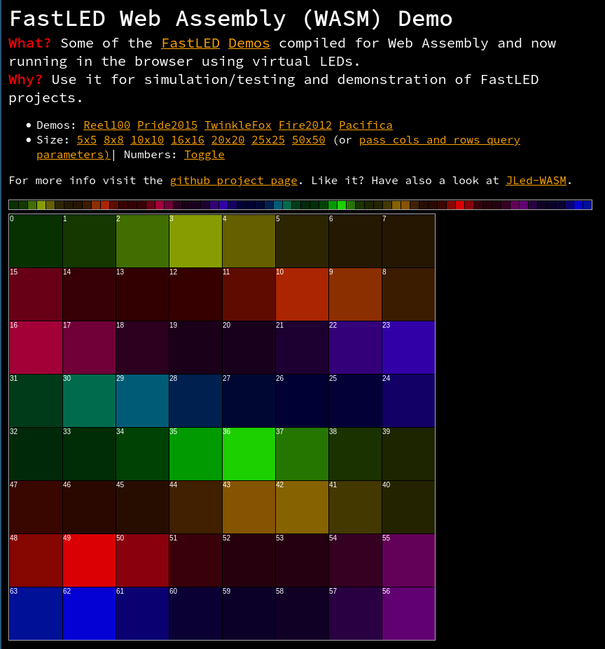

# FastLED for the web

This project compiles the embedded C++ [FastLED](http://fastled.io) library and
some of the examples to Web Assebly (WASM) and uses the browser as a virtual RGB
LED display.

[See the demo here](https://jandelgado.github.io/fastled-wasm)

## How does it work?

I did some minor changes to the FastLED code base so it compiles without any
embedded/device specific code (MR is pending).

Then I slightly modified the examples so the actual rendering is just a
function which writes to an array of CRGB values (smiliar to before, but not
using global variables). For an example [look here](https://github.com/jandelgado/fastled-wasm/blob/main/src/demo_pride.cpp).

The old Arduino style `setup` and `loop` function are no longer needed, because
we are not interfacing real hardware.

The emscripten compiler now is able to compile everything into Web Assembly
(WASM), which is a binary instruction format that can be interpreted by modern
browsers.

On the frontend-side (browser), some hand crafted JavaScript now calls the
WASM-implemented FastLed-rendering function, which results in an array of RGB
values. These values are then painted into a HTML5-canvas as a matrix or
stripe.

With a similar approach, I made an [interactive playground for my JLed
library](https://jandelgado.github.io/jled-wasm/). I exported the whole JLed
class to Javascript, which allows to use the
JLed C++API from Javascript.

## How to use it in your own project

tbd

## Local testing

* [install emscripten](https://emscripten.org/docs/getting_started/downloads.html)
* run `make && make server`
* visit http://localhost:8000

## Author & License

(c) Copyright 2020-2021 by Jan Delgado, License: MIT

